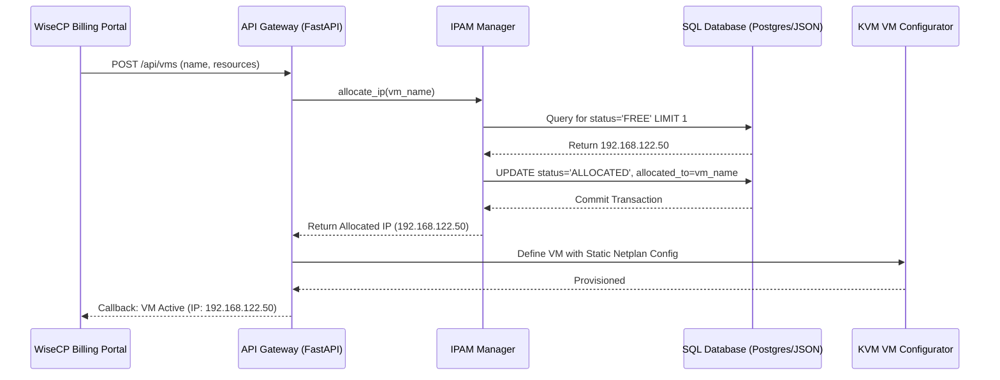

# AnkaVM Enterprise Automation Architecture

This document describes the end-to-end automation, provisioning, and billing integration architecture of the **AnkaVM** KVM hypervisor system.

---

## 🗺️ 1. IPAM (IP Address Management) Architecture

To prevent manual IP configuration mistakes, AnkaVM incorporates a stateful, transactional IPAM engine.



### IPAM Key Features:
1. **CIDR Slicing**: Handles subnets automatically using Python's native `ipaddress` library.
2. **Atomic Lock**: In SQL setups, the IP allocator executes:
   ```sql
   UPDATE ip_addresses 
   SET status = 'ALLOCATED', allocated_to_vm_id = :vm_id, updated_at = NOW()
   WHERE id = (
       SELECT id FROM ip_addresses 
       WHERE pool_id = :pool_id AND status = 'FREE' 
       ORDER BY id ASC 
       FOR UPDATE SKIP LOCKED 
       LIMIT 1
   ) RETURNING ip_address;
   ```
   The `FOR UPDATE SKIP LOCKED` statement locks the selected row, preventing double-allocation when multiple provisioning requests arrive simultaneously.

---

## ⚡ 2. Instant OS Deployer (ISO-less Backing Chains & Cloud-Init)

AnkaVM uses Copy-On-Write (CoW) backing files to deploy virtual servers in under 5 seconds instead of waiting for standard ISO installation routines.

```
                  [ Master Template Image ]
                (ReadOnly /var/lib/.../ubuntu-24.qcow2)
                               ▲
                               │ Backing File Chain
                               │
               [ VM instance Cow Disk ]  ◄─── Mounts as primary OS disk (/dev/vda)
             (vm-prod-01.qcow2 - Writeable)
```

### Provisioning Steps:
1. **Disk Cloner**: The wrapper executes a `qemu-img` command that links a writeable volume to the read-only master OS template:
   ```bash
   qemu-img create -f qcow2 -b /var/lib/libvirt/images/templates/ubuntu-24.qcow2 -F qcow2 /var/lib/libvirt/images/vm-name.qcow2
   ```
   This takes milliseconds as no data is copied initially. Only changes are written to the new file.
2. **Cloud-Init Configuration Mapping**:
   The deployer writes configuration parameters to files:
   - `user-data`: Sets SSH authorization keys, root password, package lists.
   - `meta-data`: Sets hostname, instance UUID.
   - `network-config`: Specifies the Netplan configuration matching the allocated IPAM IP.
3. **CD-ROM Compilation & Mount**:
   The files are packed into a NoCloud formatted ISO (`seed_vm-name.iso`) using `genisoimage` and attached to the VM instance as a secondary IDE CD-ROM. When KVM starts the VM, Cloud-Init reads the CD-ROM and configures the operating system on the fly.

---

## 🔌 3. WiseCP / WHMCS Module Hook (Remote Automation)

To support remote billing controls, AnkaVM exposes a structured integration doorway.

### Provisioning Callbacks Flow:
* **JWT Authorization Gate**: Billing servers authenticate using standard Bearer JSON Web Tokens or protected headers (`X-API-Key`).
* **Request Handler**:
  - The billing server sends `CreateServer` to the API gateway.
  - The gateway initiates the IPAM lookup, builds the Cloud-Init seed ISO, initializes the QCOW2 backing chain, and registers the libvirt XML file.
  - The gateway returns a `201 Created` status carrying the allocated IP.
* **Suspension Hook**:
  WiseCP sends a stop command which transitions KVM domains from `RUNNING` to `SHUT_OFF`.
* **Termination Hook**:
  Deletes the VM XML, destroys active memory pools, and purges the `.qcow2` volume and `.iso` seed file from the storage system, returning the IP to the IPAM pool.

---

## 🔒 4. Security Gateway, Rate Limiting & Validation

To secure the Hypervisor API endpoints from external threats:

1. **API Key Gatekeeping**:
   Each integration client carries a unique API token. FastAPI intercepts requests and checks this key via middleware.
2. **Input Validation Patterns**:
   Regular expression pattern checks prevent command injections through variables like VM names:
   ```python
   # Regex constraint validation in FastAPI
   if not re.match(r"^[a-zA-Z0-9_-]+$", name):
       raise HTTPException(status_code=400, detail="Command Rejected: Input contains forbidden characters.")
   ```
3. **Token Bucket Rate Limiting**:
   Protects hypervisor endpoints from DDoS by restricting requests from billing portals to a specific rate (e.g. 60 requests per minute).
